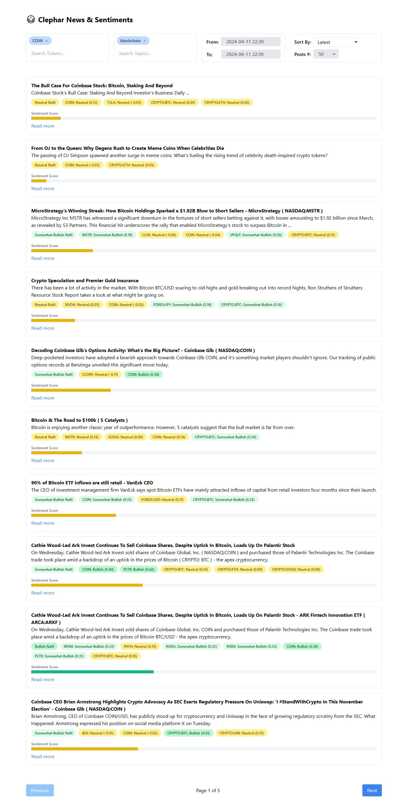

# Clephar News & Sentiments 📊

Welcome to the **News Sentiment Dashboard** repository! This application dynamically fetches and displays news articles along with sentiment analysis to help users gauge the overall sentiment and relevance of financial news in real-time.

## Application Snapshot 📸

|  |
| :--------------------------------------------: |
|                 User Interface                 |

## Features 🌟

- **Dynamic News Fetching**: Fetches the latest financial news based on selected tickers and topics.
- **Sentiment Analysis**: Displays overall sentiment and relevance scores for each news article.
- **Customizable Filters**: Allows users to filter news by tickers, topics, and date ranges.
- **Responsive UI**: A responsive and user-friendly interface that adapts to various devices.

## Quick Start 🚀

To get this project up and running on your machine, follow these simple steps:

```bash
git clone https://github.com/chizaram-igolo/clephar-news-sentiments.git
cd news-sentiment-dashboard
npm install or yarn
yarn dev
```
